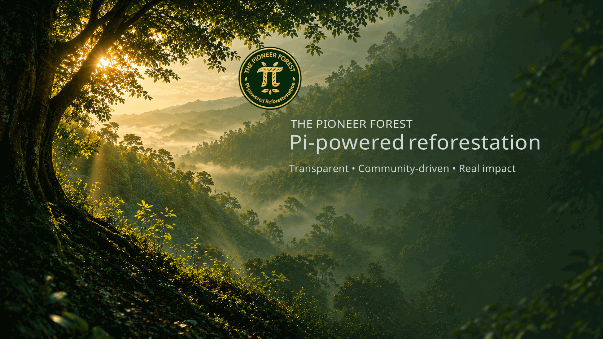
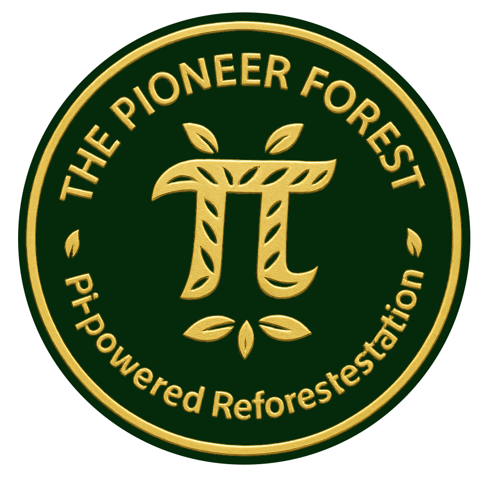

# 🌍 The Pioneer Forest — Media Kit

Welcome to the official **The Pioneer Forest (TPF) Media & Partner Kit** 🌱

**One-line summary:**  
Pi-powered, community-driven reforestation with transparent impact.

This repository provides logos, banners, visuals, and key information for anyone who wishes to reference, share, feature, or support **The Pioneer Forest**.

---

## 🔗 Quick Access

- Logos → /logos  
- Banners → /banners  
- Info → /info  

---

## 🎨 Preview

### Banner
Official visual banner for The Pioneer Forest.  

### Logo

➡️ Right-click → Save image to download assets

---

## 🌲 About The Pioneer Forest

**The Pioneer Forest (TPF)** is a community-driven reforestation initiative within the Pi Network ecosystem.

It combines:
- living campaigns  
- shared artifacts  
- and transparent impact tracking  

to create a growing, open record of environmental contribution.

### Core principles

- 🌱 **Transparent** — activity is publicly traceable  
- 🌍 **Symbolic** — participation represents measurable CO₂ impact  
- 💚 **Community-driven** — created and sustained by Pioneers  
- 🌲 **Living system** — the forest evolves through participation  

Official project page:  
➡️ https://thepioneerforest.netlify.app/forest

---

## 🔔 Official Updates & Community

Official announcements, campaign updates, and new developments are shared through the verified **Fireside Forum channel**:  
➡️ https://fireside.pinet.com/channels/ThePioneerForest

---

## 📁 Folder Overview

| Folder | Purpose |
|--------|---------|
| `/banners` | Main banner and social formats (wide + square) |
| `/logos` | Official TPF logo pack (master, white, dark, gold, icon) |
| `/info` | Partner instructions and project descriptions |

---

## 💚 Use & Attribution

You are welcome to share these materials on websites, forums, apps, or social channels to raise awareness of **The Pioneer Forest**.

Please keep the following in mind:

- Do not alter the official TPF logo or core symbols without permission  
- Credit: **“The Pioneer Forest — Pi-powered Reforestation”**  
- Link to the official project page whenever possible  

Partner usage details:  
➡️ /info/partner_instructions.md

---

## 🔗 Wallet for Donations

**Public Wallet Address (Pi Network):**  
`GDJQWS634MNY2XQ6FKOM6Z2PP5RQWEWLBNQICV43WI4IVWT3RC7VHD3M`

**Transaction Note:**  
`ThePioneerForest`

All donations directly support verified CO₂-offset tree planting 🌳

---

## 📬 Contact

**Pi Chat:** @egal42  
**Email:** egal42.pi@gmail.com  
**Fireside Forum:** https://fireside.pinet.com/channels/ThePioneerForest

---

Art shapes it.  
Trust sustains it.
